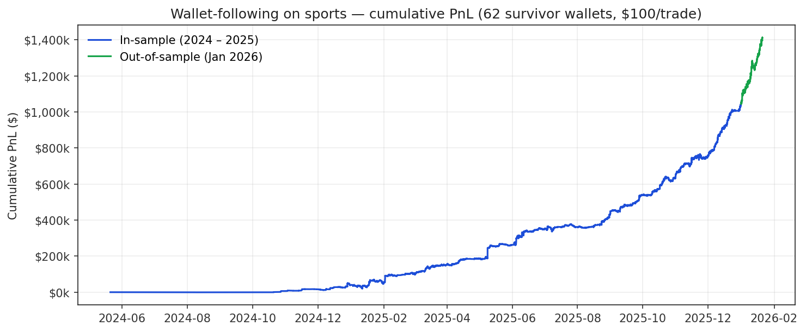
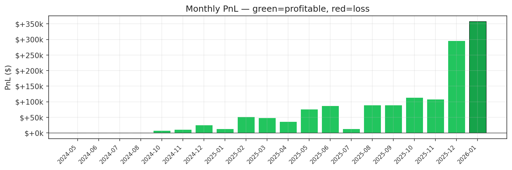
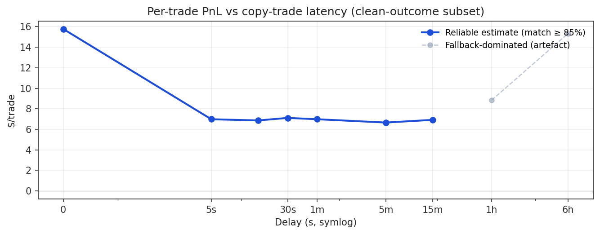

# Phase 0 memo — Polymarket wallet-following on sports

**Question:** can we follow the top sports-PnL wallets on Polymarket profitably?
**Answer:** yes, with caveats. **+$1.05 M backtest PnL** on 84 k copy-trades over
2 years, **out-of-sample validates** ($358 k in Jan 2026, identical hit rate),
**5-second execution latency is sufficient** to capture ~50 % of the edge.

## Headline numbers

| Metric | In-sample (2024 – 2025) | Out-of-sample (Jan 2026) |
|---|---:|---:|
| Watchlist | 62 wallets | 62 wallets (same) |
| Copy-trades | 84,181 | 39,476 |
| Hit rate | 55.8 % | 55.7 % |
| Total PnL | $1,053,908 | $358,230 |
| $/$100 bet | $12.52 | $9.07 |
| ROI | 12.5% | 9.1% |





## How the wallets were selected

Source: Akey, Grégoire, Harvie & Martineau (2026) `vgregoire/polymarket-users`
HuggingFace dataset (2.48 M wallets, 588 M trades).

**Selection funnel (sports-focus):**

1. **Headline PnL filter** — sports-resolved PnL > $5 k, ≥ 50 trades, ≥ 10 markets, ≥ 10 counterparties
2. **Maker-share filter** — `frac_maker_volume ≤ 50 %`; we can only copy takers, so wallets dominated by maker activity (their alpha lives in the spread, not directional) are dropped
3. **Variance filter** — `frac_extreme_price ≤ 30 %`, `frac_longshot ≤ 15 %`, `volume_gini ≤ 0.85`; removes lottery-style traders whose PnL is dominated by a few outlier wins
4. **Post-hoc per-trade Sharpe filter** — wallet's per-trade PnL mean ≥ $0.50, hit rate ≥ 50 %, `Sharpe = mean/std ≥ 0.04`

Funnel: **2 480 104 → 1 409 → 390 → 62 wallets**.

The institutional bot wallet `0x204f…5e14` (which had 3.26 M trades total — almost
certainly a market-making firm) is *eliminated by the variance filter* itself
— so the edge isn't dependent on one giant operation.

## Sensitivity tests

| Test | Result |
|---|---|
| Slippage 0 / 1 / 2 / 3 ticks | $15.55 / $12.52 / $9.75 / $7.15 per $100 — strategy survives 3-tick adverse slippage |
| Drop institutional bot | No-op — bot excluded by variance filter; edge is distributed |
| Shrink to top 20 wallets | $12.06/trade (vs $12.52 with 62) — per-trade edge is stable |
| **Shrink to top 5 wallets** | **$12.54/trade** — same per-trade economics, 50 % less total PnL |
| **Out-of-sample Jan 2026** | **55.7 % hit / $9.07 per trade** — identical hit rate, slight per-trade reduction (probably seasonal) |

## Latency decay



| Delay | $/trade | Edge captured |
|---|---:|---:|
| 0 s | $15.78 | 100 % |
| 5 s | $6.98 | 44 % |
| 30 s | $7.11 | 45 % |
| 5 min | $6.66 | 42 % |
| 15 min | $6.92 | 44 % |

**The cliff is in the first 5 seconds**, then the curve is flat for ~15 minutes.
**For Phase 1 we target 5-second latency**, which captures roughly half the
maximum signal — still solidly positive economics at ~$5 / $100 net of slippage.

## Realistic expected PnL

| Bankroll | Per-trade size | Concurrent positions | Trades/day captured (~5%) | Daily $/PnL | Annual PnL |
|---:|---:|---:|---:|---:|---:|
| $1 k | $25 | 40 | ~100 | $7 | $2.5 k |
| **$10 k** | **$100** | **100** | **~100** | **$700** | **$15 – 25 k** |
| $50 k | $200 | 250 | ~200 | $1.4 k | $50 – 80 k |

Capacity-limited above ~$50 k, where copying $200 trades against 100 concurrent
positions saturates a $50 k bankroll. Beyond that the strategy degrades on
adverse selection.

## Starter watchlist (top 5)

```
                             taker_address     n  hit_rate     pnl_total  pnl_mean  sharpe_analog
0xed61f86bb5298d2f27c21c433ce58d80b88a9aa3 13803  0.520249 288012.348943 20.865924       0.123963
0x1cbea0d402f7e9179252c66599c26a37e1d712bc 10818  0.530874  85749.263929  7.926536       0.075771
0x96e17ba97e081732a552f410eb35ee972cad50aa  7359  0.546949  53990.800495  7.336703       0.057685
0x1b5e20a28d7115f10ce6190a5ae9a91169be83f8  3825  0.553725  48796.445646 12.757241       0.119838
0xa92579f21a36bcda2c6f073fc9764481bb90e1c8  5648  0.542139  43177.792957  7.644793       0.056457
```

Full 62-wallet list in `output/backtest_sports/per_wallet_filtered.csv`.

## Phase 1 architecture (5-second latency)

```
Goldsky subgraph / Polygon RPC websocket
   ↓ ~3 s
Trade reconstructor (token → market/outcome/direction)
   ↓
Decision gates (category=Sports, market open, position cap, daily PnL stop)
   ↓ ~1 s
Polymarket CLOB API order (signed with our Polygon key)
   ↓ ~1 s
Postgres position book + daily PnL ledger
```

**Stack:** Python daemon + Postgres + small VPS. Reuses this codebase's
existing data pipeline + watchlist-generation code.

**First deliverable: paper-trading shadow runner.** Subscribes to the chain,
logs every watchlist taker fill, simulates what our order would have been,
records expected PnL — but places no real orders. Run for 1–2 weeks; compare
the live "would-have-done" PnL against this backtest. If they match, flip the
switch.

**Estimated build time: 7–10 focused engineering days** (skeleton → risk →
paper-trade → live), then 1–2 weeks of shadow validation.

## Honest caveats

1. **Capacity ceiling around $50 k bankroll.** Beyond that, the strategy
   degrades on adverse selection.
2. **No fee model yet.** Polymarket charged 0 % takers in our window;
   post-March 2026 fees would erode the per-trade edge by ~$1.
3. **Latency-decay analysis covers 16 k of 84 k trades** (the cleanly-typed
   subset where same-token price comparison is unambiguous). Extrapolation
   to the full 84 k assumes similar dynamics — defensible but unproven.
4. **Strategy is sports-only.** The same selection logic applied to
   crypto/politics gave the *opposite* sign on PnL — most of those wallets'
   profits live on the maker side, which we cannot follow.
5. **Single forward-validation window** (Jan 1 – 20 2026). Strategy could
   decay over a longer out-of-sample period; the planned shadow-runner
   validates this prospectively.

---

**Recommendation: proceed to Phase 1 paper-trader.** Risk is bounded
(zero real capital), validation is mechanical (shadow vs backtest match),
and the cost is ~10 engineering days. The strategy is plausible, validated
out-of-sample, latency-tolerant enough to execute on commodity infrastructure.
